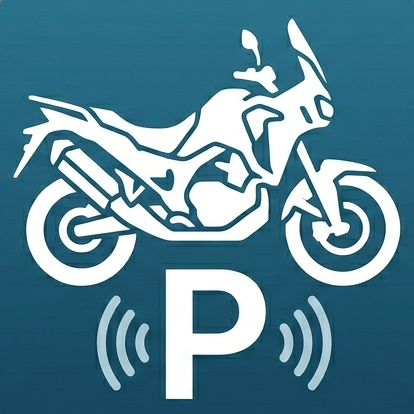

<div align="center">



# MotoPark — バイク駐輪場マップ

**全国のバイク用「時間貸し」駐輪場を地図で探せるアプリ**

Flutter 製 / Web・Windows デスクトップ対応 / PWA 対応

</div>

---

## 概要

MotoPark は、ライダーが出先で**バイクを停められる時間貸し駐輪場**をすばやく見つけるためのアプリです。
[JMPSA(日本二輪車普及安全協会)](https://www.jmpsa.or.jp/society/parking/) の全国駐輪場データ **38,799 件**を同梱し、オフラインでも地図上に表示できます。予約制（akippa・特P 等）の駐輪場では、詳細画面から備考・写真・予約サイトへのリンクも確認できます。

## 主な特徴

- 🗺️ **全国 38,799 件の駐輪場を地図表示** — JMPSA の時間貸し駐輪場データを同梱
- 📍 **現在地から探せる** — 起動時に現在地へ移動、周辺の最新情報も動的取得
- 🔎 **ライダー向けの絞り込み** — 予約の要否 / 排気量 / 屋根 / 地球ロック / 路面 / 傾斜
- 🅿️ **予約制スポットに対応** — 詳細画面で備考・写真・予約サイトへのリンクを表示
- ❤️ **お気に入り / 最近見た** — よく使う駐輪場を保存、最近見た場所もすぐ呼び出し
- 📤 **共有** — 駐輪場の名称・住所・地図リンクを共有
- 🧭 **ナビ連携** — 目的地までの経路案内を外部マップアプリで起動
- 📱 **PWA 対応** — ブラウザから「ホーム画面に追加」でアプリのように利用可能
- ⚡ **大量マーカーでも軽快** — 表示領域内のみ描画するビューポートカリング

## 対応プラットフォーム

| プラットフォーム | 地図エンジン | 備考 |
|---|---|---|
| **Web** | Google Maps | PWA 対応。ライブ取得は CORS プロキシ経由 |
| **Windows（デスクトップ）** | OpenStreetMap ([flutter_map](https://pub.dev/packages/flutter_map)) | `google_maps_flutter` がデスクトップ非対応のため |

> Windows と Web で地図エンジンを自動で切り替えます（`defaultTargetPlatform` で判定）。
> ※ iOS / Android / Linux / macOS は対象外です。

## 技術スタック

- **Flutter** / Dart
- 地図: [`google_maps_flutter`](https://pub.dev/packages/google_maps_flutter)（Web）, [`flutter_map`](https://pub.dev/packages/flutter_map) + OpenStreetMap（デスクトップ）
- 位置情報: [`geolocator`](https://pub.dev/packages/geolocator)
- 通信: [`http`](https://pub.dev/packages/http)
- 共有: [`share_plus`](https://pub.dev/packages/share_plus)
- 状態管理: [`provider`](https://pub.dev/packages/provider)
- ローカル保存: [`shared_preferences`](https://pub.dev/packages/shared_preferences)（設定・お気に入り・最近見た・ユーザー登録分）

## データについて

- 同梱データ [`assets/jmpsa_spots.json`](assets/jmpsa_spots.json)（約 24MB / 38,799 件）は、
  [`tool/harvest_jmpsa.dart`](tool/harvest_jmpsa.dart) で JMPSA から一括取得して生成します。
  ```bash
  dart run tool/harvest_jmpsa.dart   # 全47都道府県を巡回（約20分）
  ```
- 起動時にバックグラウンド isolate で読み込み、地図には**表示領域内・ズーム13以上・最大50件**のみ描画します。
- 詳細（備考・予約URL・写真）は、スポットを開いたときに JMPSA の詳細ページから**遅延取得**します。
- ユーザーが追加・通報した分は端末内（SharedPreferences）に保存します（ログイン不要）。

> 出典: [JMPSA(日本二輪車普及安全協会) 全国バイク駐車場案内](https://www.jmpsa.or.jp/society/parking/)。
> 料金・営業時間等は変動する場合があるため、利用時は現地表示・各サービスをご確認ください。

## セットアップ

```bash
flutter pub get
```

### 起動

```bash
flutter run -d windows   # Windows デスクトップ（OpenStreetMap）
flutter run -d chrome    # Web（Google Maps）
```

> Web の Google Maps を表示するには API キーが必要です（後述「APIキーの設定」）。
> Windows デスクトップは OpenStreetMap を使うため API キー不要です。

## ビルド・デプロイ

### Web（GitHub Pages・無料）

`main` ブランチへの push で [GitHub Actions](.github/workflows/deploy-web.yml) が自動ビルド・公開します。

- 公開 URL: `https://<ユーザー名>.github.io/<リポジトリ名>/`
- `--base-href` をリポジトリ名に合わせること
- 公開 Web 版でライブ取得（周辺検索・詳細）を動かすには、JMPSA は CORS 非対応のため
  [Cloudflare Worker のプロキシ](cloudflare-worker/jmpsa-proxy.js) を経由します
  （`--dart-define=JMPSA_PROXY=<WorkerのURL>`）。同梱データのみなら不要です。

### Windows デスクトップ

```bash
flutter build windows   # build/windows/x64/runner/Release/ に実行ファイルが生成される
```

### アプリアイコンの再生成

```bash
dart run flutter_launcher_icons   # assets/icon/app_icon.png から Web / Windows 分を生成
```

## APIキーの設定

Google Maps の API キーは**リポジトリに含めず**、ビルド時に注入します。

| 用途 | 設定方法 |
|---|---|
| **Web（公開）** | GitHub の Secrets に `GOOGLE_MAPS_API_KEY` を登録（Actions がビルド時に `web/index.html` へ注入） |
| **ローカルWeb開発** | `web/index.html` の `__GOOGLE_MAPS_API_KEY__` を一時的に自分のキーへ置換（コミットしない） |

> Web の Maps キーは仕組み上ブラウザから見えるため、Google Cloud Console で
> **HTTPリファラー制限**（公開ドメイン・`localhost`）と **API 制限**を必ず設定してください。

## プロジェクト構成

```
lib/
  models/        ParkingSpot / SpotFilter などのデータモデル
  services/      JMPSA取得・データセット・位置情報・保存リポジトリ・ユーザー設定
  screens/       地図 / 詳細 / 新規登録 / 設定 / 保存(お気に入り・最近見た)
  widgets/       絞り込みシート 等
assets/
  jmpsa_spots.json   同梱の全国データ(harvest生成)
  icon/              アプリアイコン素材
tool/
  harvest_jmpsa.dart 全国データ一括取得スクリプト
cloudflare-worker/
  jmpsa-proxy.js     Web公開用のCORSプロキシ
```

## 免責

- 本アプリのデータは JMPSA の公開情報を参照しています。内容の正確性・最新性は保証されません。
- 料金・営業時間・予約要否は変動する場合があります。実際の利用時は現地表示および各予約サービスをご確認ください。
